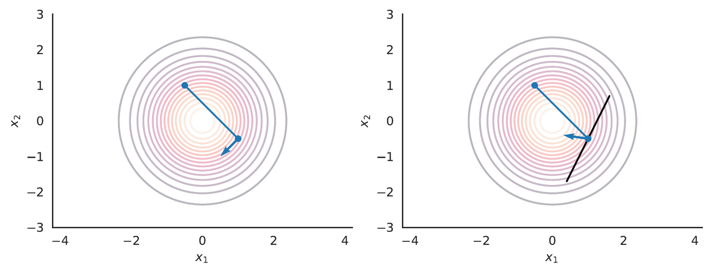
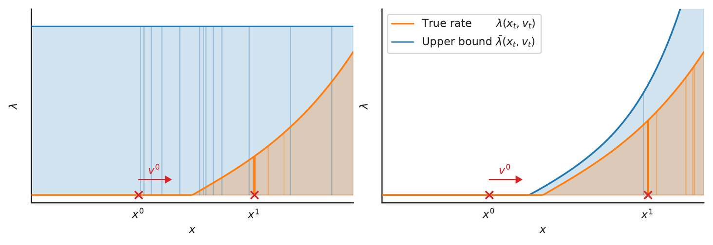
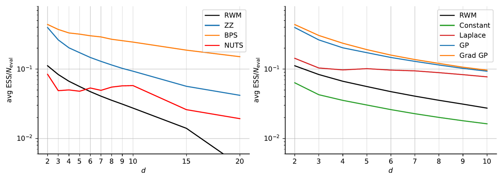
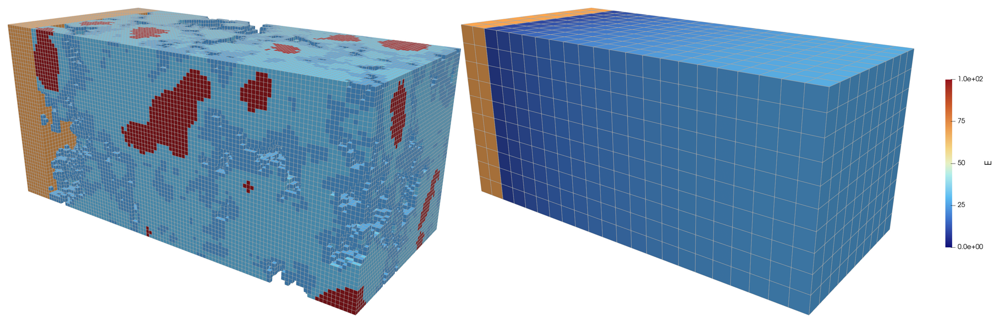
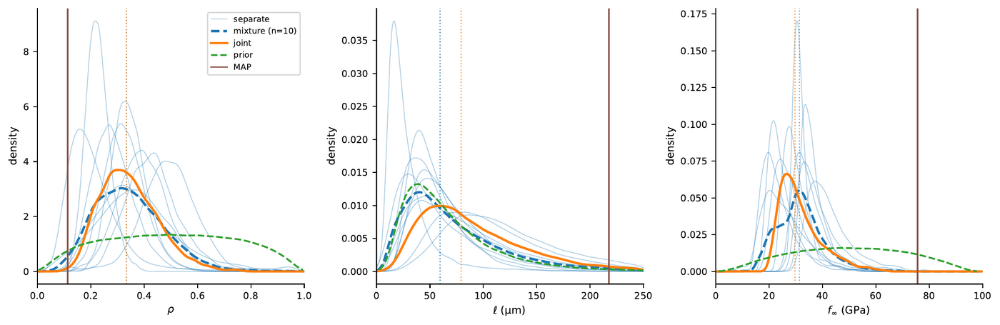

# pdmp

**Surrogate-assisted Piecewise Deterministic Markov Process samplers for Bayesian inverse problems in computational mechanics.**

`pdmp` couples irreversible continuous-time samplers — the Zig-Zag Sampler (ZZS) and the Bouncy Particle Sampler (BPS) — with JAX-based finite element forward models, so that posteriors over PDE coefficients can be sampled at a cost that is dominated by *far fewer* forward solves than conventional MCMC would need. Traditional samplers (RWM, MALA, HMC, NUTS) are implemented alongside them under a common interface, which makes the framework equally usable as a benchmarking testbed.

The code implements the method of [Riccius et al. (2026)](#papers) and the application study that builds on it.

---

## Table of contents

- [Why PDMPs](#why-pdmps)
- [The core idea: thinning with surrogates](#the-core-idea-thinning-with-surrogates)
- [What it buys you](#what-it-buys-you)
- [A worked application](#a-worked-application)
- [Installation](#installation)
- [Quick start](#quick-start)
- [Architecture](#architecture)
- [Component catalogue](#component-catalogue)
- [Driver scripts](#driver-scripts)
- [Repository layout](#repository-layout)
- [Examples](#examples)
- [Testing and CI](#testing-and-ci)
- [Containers and clusters](#containers-and-clusters)
- [Documentation](#documentation)
- [Papers](#papers)

---

## Why PDMPs

A PDMP sampler does not propose-and-accept. It follows a deterministic trajectory through parameter space, interrupted at random times by *events* that change its velocity. Because the dynamics are irreversible, the sampler does not diffuse: it travels ballistically through the bulk of the posterior and turns around only when it starts climbing into the tails.

<p align="center">
  
</p>

*Left:* the **Zig-Zag Sampler** flips one velocity component at a time, so velocities live on `{-1, +1}^d`.
*Right:* the **Bouncy Particle Sampler** reflects the full velocity vector against the hyperplane tangent to the potential's isocontour (black line), with occasional random velocity refreshments to guarantee ergodicity.

Event times come from an inhomogeneous Poisson process whose rate `λ(x_t, v_t)` depends on the gradient of the log-density. For a PDE-governed posterior, evaluating that rate means solving the forward problem — which is exactly the cost we want to avoid paying too often.

## The core idea: thinning with surrogates

Event times are generated by **Poisson thinning**: candidate times are drawn from a cheap upper-bound process `λ̄ ≥ λ`, and each candidate is accepted with probability `λ/λ̄`. Every rejected candidate costs one evaluation of the true rate — i.e. one forward solve. The tighter the bound, the fewer wasted solves.

<p align="center">
  
</p>

*Left:* a loose constant bound produces a thicket of rejected candidates (blue).
*Right:* a tight bound accepts almost immediately (orange).

This repository's contribution is to build `λ̄` from a **surrogate model** of the log-density, plus a correction mechanism that dynamically inflates an additive offset whenever a bound violation is detected during simulation. The correction makes the scheme *agnostic to the surrogate*: anything that induces a computable proposal rate can be plugged in, from a constant potential through a Laplace approximation to a gradient-informed, adaptively refined Gaussian process. The result is an approximate but robust sampler whose accuracy is controlled by the quality of the surrogate rather than by hand-tuned bounds.

## What it buys you

<p align="center">
  
</p>

Effective sample size per forward-model evaluation on a 1-D linear elasticity inverse problem, as a function of the parameter dimension `d`.

*Left:* PDMP samplers against Random Walk Metropolis and NUTS. Both the ZZS and the BPS deliver more effective samples per solve across every dimension tested, and the BPS scales best.
*Right:* the effect of the surrogate choice. A constant bound is worse than RWM; a Laplace surrogate is already competitive; GP surrogates — especially the gradient-informed variant — dominate.

## A worked application

The framework was applied to a real engineering inverse problem: inferring the mechanical properties of the **interfacial transition zone (ITZ)** in concrete — the thin, porous shell of cement paste around each aggregate that governs mesoscale stiffness and cracking, and that is too thin to characterise with bulk tests.

<p align="center">
  
</p>

A fully resolved finite element model of a micro-cantilever specimen (*left*) provides synthetic displacement data. The inference model (*right*) replaces the microstructure with a homogenized ITZ described by a handful of stiffness descriptors — a smooth exponential-recovery stiffness profile away from the aggregate interface. The systematic error introduced by that reduction is absorbed by a Kennedy–O'Hagan model-discrepancy term rather than being silently pushed into the parameters.

<p align="center">
  
</p>

Posterior marginals of the ITZ descriptors — the stiffness ratio `ρ` at the interface, the recovery length `ℓ`, and the far-field modulus `f_∞` — sampled with the BPS. Per-specimen posteriors (thin blue), their mixture, a pooled joint calibration (orange) and the prior (green) are compared; the calibrated descriptors and their uncertainty then feed a mesoscale RVE model.

---

## Installation

```bash
mamba env create -f environment.yml     # or environment_amd.yml for ROCm/AMD
conda activate pdmp-jax
```

`jax-fem` is pinned to a specific commit and installed separately:

```bash
git clone https://github.com/deepmodeling/jax-fem.git /tmp/jax-fem
cd /tmp/jax-fem && git checkout c3fbcb3
pip install /tmp/jax-fem
```

`pdmp` itself is used in place — run the driver scripts from the repository root (or put the repository on `PYTHONPATH`); there is no install step.

## Quick start

Everything is driven by a single YAML file. A minimal Bayesian inverse problem, sampled with the Bouncy Particle Sampler and a GP surrogate:

```yaml
name: ExponentialRecovery
seed: 0

problem:
  name: BayesianInverse
  prior:
    name: FromField              # reuse the field's coefficient distribution
  likelihood:
    name: GaussianLikelihood
    observation_file: observations.dat
    sigma: 0.005
  model:
    name: JaxFem
    h: 0.25                      # mesh size
    d_x: 1.0
    d_y: 1.0
    d_z: 2.5
    nu: 0.3
    field:
      name: JaxExponentialRecoveryField   # "Jax" prefix ⇒ autodiff-capable field
      f_infinity: 1.0
      idx: 0
      coefficient_distribution:
        name: MultivariateNormal
        mean: [0.5, 0.9]
        cov: [[2.0, 0.0], [0.0, 2.0]]
    sensors:
      - name: sensors_x0
        location_fn: side_faces
        points: [[0.0, 0.5, 1.0]]

sampler:
  name: BouncyParticle           # key in SAMPLER_REGISTRY
  t_max: 100
  refresh_rate: 0.1
  offset_shrinkage: 0.02

surrogate:
  name: GaussianProcess          # key in SURROGATE_REGISTRY
  n_samples: 100
  n_restarts: 50
  train_on_init: true

output:
  dir: .
  logging:
    level: INFO
    log_file: inference.log
```

Run it:

```bash
python run_inference.py --config path/to/config.yaml
```

All relative paths inside the config (observation files, meshes, output directory) resolve against the *config file's* directory, not the shell's working directory, so a case directory is self-contained and can be run from anywhere.

**Outputs.** A completed run writes into `output.dir`:

| File | Contents |
|---|---|
| `positions.dat`, `velocities.dat`, `times.dat` | The PDMP trajectory (event states and event times) |
| `samples.dat`, `accepted.dat`, `proposals.dat` | MCMC chains (for the `StepSampler` family) |
| `times_all.dat`, `eval_times.dat`, `offset_history.dat` | Thinning diagnostics: candidate times, rate-evaluation times, offset corrections |
| `rate_evals_per_event.dat`, `n_evals.dat` | Forward-model cost accounting |
| `other.json` | Acceptance rate, final offset, solver rejections |
| `config_used.yaml` | The fully resolved config, including any auto-computed affine transform |

**Long runs.** Add a `checkpoint` block to survive scheduler kills. Resuming restores the numpy `Generator` bit-state, so the sample path is bit-identical to an uninterrupted run:

```yaml
checkpoint:
  enabled: true
  interval_minutes: 10
  dir: checkpoints
```

A resubmitted job that finds `checkpoints/completed.flag` is a no-op; an unexpected failure drops `error.flag` so a self-resubmitting chain halts instead of looping.

## Architecture

### Data flow

```
YAML config → loader.get_config()
                 ├─ get_target()    → Distribution   (prior × likelihood = Posterior)
                 ├─ get_surrogate() → SurrogateModel (optional, provides the proposal rate)
                 └─ get_sampler()   → Sampler
                                         └─ .run() → trajectory / samples
```

`loader.py` is the single wiring point. `get_config()` loads the YAML and converts numeric lists to NumPy arrays automatically (excluding `hidden_layers`, `update_model` and `indices`).

### Registry pattern

Samplers and surrogates self-register, so adding one requires no edits to the loader:

```python
from pdmp.sampler import Sampler, register_sampler

@register_sampler('MyNewSampler')
class MyNewSampler(Sampler):
    def run(self): ...
    def write_data(self, folder='.', precision=6): ...
    @classmethod
    def from_dict(cls, target, rng, surrogate=None, **kwargs): ...
```

The name string is what goes into `sampler.name` in the YAML. Forward models are dispatched by name in `forward_model.get_model()`, fields in `random_field.get_field()` / `get_jax_field()`.

### JAX vs NumPy fields

`get_target()` inspects the field's `name`: anything starting with `Jax` is built by `get_jax_field()` (JAX arrays, autodiff-compatible); everything else by `get_field()` (NumPy). Forward models that need gradients — `JaxFemModel` above all — require a JAX field.

### Working in transformed coordinates

Parameters are almost always sampled in an unconstrained space and mapped to physical values by a `Transformation` (log, exponential, sigmoid, logit, affine, or a `CompositeTransformation` applying different maps to different index blocks). On top of that, an outer `Affine` transformation whitens the posterior using its Laplace approximation `(b, M)` — PDMPs are invariant under affine reparameterisation, and a whitened target makes their trajectories dramatically more efficient. If `M`/`b` are omitted they are computed once and cached in an `affine_params.npz` sidecar, so resumed runs never re-optimise.

## Component catalogue

**Samplers** (`sampler.name`)

| Name | Module | Notes |
|---|---|---|
| `ZigZag` | `zigzag.py` | Component-wise velocity flips; no tuning parameters |
| `BouncyParticle` | `bouncy_particle.py` | Velocity reflection + refreshment rate; best observed scaling |
| `RandomWalkMetropolis` | `mcmc.py` | Adaptive-step baseline |
| `LangevinDynamics` | `mcmc.py` | MALA |
| `HamiltonianMonteCarlo` | `mcmc.py` | Fixed trajectory length |
| `NaiveNUTS`, `EfficientNUTS`, `DualAveragingNUTS` | `mcmc.py` | No-U-Turn variants, the last with step-size adaptation |

Both PDMP samplers support analytic rates where available and, otherwise, either an adaptive ODE integrator (`integrator: ode`, `scipy.solve_ivp`) or a fixed-step scheme for event-time generation — see [`docs/inverse_cdf_ode.md`](docs/inverse_cdf_ode.md).

**Surrogates** (`surrogate.name`)

| Name | Notes |
|---|---|
| `Constant` / `RandomConstant` | Constant proposal potential; the cheapest possible bound |
| `Laplace` | Quadratic surrogate from the Gaussian-at-MAP approximation |
| `GaussianProcess` | GP on the log-density residual over the Laplace approximation |
| `DerivativeGaussianProcess` | GP trained on values *and* gradients |
| `NeuralNetwork` | Torch MLP surrogate |

The GP surrogates support Bayesian-optimisation-style adaptive refinement, with acquisition functions that target maximum (optionally density-weighted) predictive variance.

**Forward models** (`problem.model.name`)

| Name | Notes |
|---|---|
| `JaxFem` | jax-fem PDE solver (linear elasticity); JAX autodiff throughout |
| `PiecewiseConstant` | Analytic 1-D bar with a piecewise-constant modulus |
| `Linear` | Linear map; useful for verification |
| `RVE` | 2-D representative volume element, plane strain, periodic BCs |
| `RVEPerFiber` | RVE with per-fiber ITZ property assignment |

**Random fields** (`problem.model.field.name`)

| Name | Notes |
|---|---|
| `JaxExponentialRecoveryField` | `F(x) = F_∞ (1 − (1 − ρ) e^{−x/ℓ})` — the ITZ stiffness profile |
| `JaxGaussianRandomField` | Gaussian field whose covariance comes from projecting a spatial kernel onto a finite basis |
| `JaxRandomField` | Same machinery with an arbitrary (non-Gaussian) coefficient distribution |
| `JaxConstantField` | Spatially uniform but uncertain |
| `GaussianRandomField` | NumPy counterpart (no autodiff) |

Field discretisation bases live in `project_field.py` (`ConstantBasis`, `PiecewiseConstantBasis`, `NormPiecewiseConstantBasis`, arbitrary spatial dimension).

**Priors** (`problem.prior.name`): `MultivariateNormal`, `MultivariateLogNormal`, `GaussianMixture`, `Gamma`, `Beta`, `Banana`, `Cubic`, `PerFiberEmpiricalMixture`, `FromField`.

**Likelihoods** (`problem.likelihood.name`): `GaussianLikelihood`, `KOGaussianLikelihood` (Kennedy–O'Hagan model discrepancy, `discrepancy.py`), `TemperedLikelihood`, `TransformedLikelihood`, `FlatLikelihood`.

## Driver scripts

| Script | Purpose |
|---|---|
| `run_inference.py` | The main entry point: build target + surrogate + sampler from YAML and sample |
| `run_map.py` / `run_mle.py` | Deterministic MAP / maximum-likelihood point estimates |
| `run_laplace.py` | Laplace (Gaussian-at-MAP) approximation, written as `mean.dat` / `cov.dat` / `samples.dat` |
| `generate_observations.py` | Synthesise noisy observations from a forward model for a known ground truth |
| `forward_uq.py` | Forward UQ by pushing posterior samples through a forward model |
| `forward_uq_moment.py` | Forward UQ by moment matching — unscented transform and linearisation |
| `eval_fem_sample.py` | Evaluate the FE displacement field at a posterior sample (or the posterior mean) and export VTK |
| `plot_forward_uq*.py`, `plot_find_mean_trace.py` | Plotting for the above |
| `run_study.py` | Batch-submit parameter studies to a PBS cluster |

## Repository layout

```
pdmp/                     the package
├── sampler.py              base Sampler + SAMPLER_REGISTRY + checkpointing
├── zigzag.py               ZigZagSampler
├── bouncy_particle.py      BouncyParticleSampler
├── mcmc.py                 StepSampler family (RWM, MALA, HMC, NUTS)
├── surrogates.py           surrogate models + SURROGATE_REGISTRY
├── distributions.py        Distribution/Posterior/Likelihood/Transformation hierarchy,
│                           plus find_mean / find_curvature for the Laplace approximation
├── discrepancy.py          Kennedy–O'Hagan discrepancy likelihood
├── forward_model.py        PiecewiseConstantModel, JaxFemModel, RVEModel, …
├── random_field.py         spatial field types (NumPy and JAX)
├── project_field.py        basis functions for field discretisation
├── rve_utils.py            plane-strain RVE problems and homogenisation
├── kernels.py              GP covariance kernels
├── loader.py               YAML → objects; the single wiring point
├── plotting.py             shared plotting helpers
└── utils.py                running moments along a PDMP skeleton, ESS, finite differences

tests/                    27 pytest modules
docs/                     design notes and derivations (see below)
examples/                 runnable case directories, each with its own config.yaml
pdmp/data/msh/            default meshes (per-case meshes live in the example dirs)
apptainer/, Dockerfile    container recipes
ci/                       CI image build and notes
misc/                     colormaps and ParaView scripting helpers
```

## Examples

Each example directory is self-contained — a `config.yaml`, its observations, and the outputs of a run.

| Directory | What it shows |
|---|---|
| `examples/inverse_problem/exponential_recovery_field/` | The canonical 2-parameter inverse problem; ZZS, BPS and RWM side by side. Has its own [README](examples/inverse_problem/exponential_recovery_field/README.md) |
| `examples/inverse_problem/constant_field/` | Simplest possible field; good first run |
| `examples/inverse_problem/itz/` | The full ITZ calibration, with and without Kennedy–O'Hagan discrepancy |
| `examples/kennedy_ohagan/` | Isolated discrepancy-term studies, including the posterior shift it induces |
| `examples/forward_uq/` | Pushing posteriors through the RVE model; sampling vs. moment matching |
| `examples/bps_event_study/` | Event-rate and refreshment-rate diagnostics for the BPS |
| `examples/checkpointing/` | Interrupted vs. uninterrupted runs, demonstrating the bit-identical resume |
| `examples/rve_2d/`, `examples/rve_per_fiber/` | RVE forward models and per-fiber property assignment |
| `examples/jax-fem/` | Standalone jax-fem models, mesh convergence studies |

## Testing and CI

```bash
pytest --cov=pdmp                              # full suite
pytest tests/test_distributions.py -v          # one module
pytest tests/test_distributions.py::test_name  # one test

python -m cProfile -o out.prof script.py && snakeviz out.prof   # profiling
```

CI runs `pytest --cov=pdmp` inside a Docker image with the conda environment and `jax-fem` pre-baked. Because `gitlab.tudelft.nl` has no container registry, the image lives only in the runner host's local daemon — rebuild it with `ci/build-image.sh` and bump the tag in `.gitlab-ci.yml` whenever `environment.yml` changes. See [`ci/README.md`](ci/README.md).

## Containers and clusters

- `Dockerfile` — the CI image; build context is restricted to `environment.yml`.
- `apptainer/pdmp.def` + `apptainer/build.sh` — Apptainer/Singularity image for HPC systems, including the system libraries gmsh's bundled binary needs.
- `sync_cluster.sh` — rsync the working tree to a cluster.
- `run_study.py` — submit parameter sweeps to PBS, throttled by the number of CPUs already in use.
- `docs/setup_rocm_amd.md` — notes for AMD/ROCm GPUs (see also `environment_amd.yml`).

## Documentation

Design notes and derivations live in `docs/`:

| Document | Topic |
|---|---|
| [`inverse_cdf_ode.md`](docs/inverse_cdf_ode.md) | Adaptive ODE event-time generation, the inner loop of every PDMP step |
| [`exponential_recovery_field.md`](docs/exponential_recovery_field.md) | The ITZ stiffness profile, its parameters and boundary conditions |
| [`jax_random_fields.md`](docs/jax_random_fields.md) | JAX field protocol and autodiff requirements |
| [`composite_transformation_guide.md`](docs/composite_transformation_guide.md), [`composite_transformation_diagrams.md`](docs/composite_transformation_diagrams.md) | Applying different transformations to different parameter blocks |
| [`constant_basis_multidim.md`](docs/constant_basis_multidim.md) | Multi-dimensional constant basis and volume normalisation |
| [`kennedy_ohagan_discrepancy.md`](docs/kennedy_ohagan_discrepancy.md) | The model-discrepancy formulation |
| [`moment_matching.md`](docs/moment_matching.md) | Unscented transform and linearisation for forward UQ |
| [`sensor_configuration.md`](docs/sensor_configuration.md) | Sensor placement and boundary-face naming conventions |
| [`setup_rocm_amd.md`](docs/setup_rocm_amd.md) | AMD GPU setup |

## Papers

**Method.**
L. Riccius, I. B. C. M. Rocha, J. Bierkens, H. Kekkonen, F. P. van der Meer,
*Piecewise Deterministic Markov Processes for Bayesian Inference of PDE Coefficients.*

> We develop a general framework for PDMP samplers that enables efficient Bayesian inference in non-linear inverse problems with expensive likelihoods. The key ingredient is a surrogate-assisted thinning scheme in which a surrogate model provides a proposal event rate and a robust correction mechanism enforces an upper bound on the true rate by dynamically adjusting an additive offset whenever violations are detected.

**Application.**
L. Riccius, I. B. C. M. Rocha, F. P. van der Meer,
*Quantifying the Uncertainty of the Interfacial Transition Zone.*

Propagates lower-scale information about the ITZ — geometry and micromechanical response — into the mechanical properties of a homogenized mesoscale model, while quantifying the uncertainty of the inferred descriptors. The first application of the BPS to a real-world engineering problem.

All figures in this README are taken from these two manuscripts.

## Acknowledgements

This work is supported by the TU Delft AI Labs programme through the SLIMM lab.
